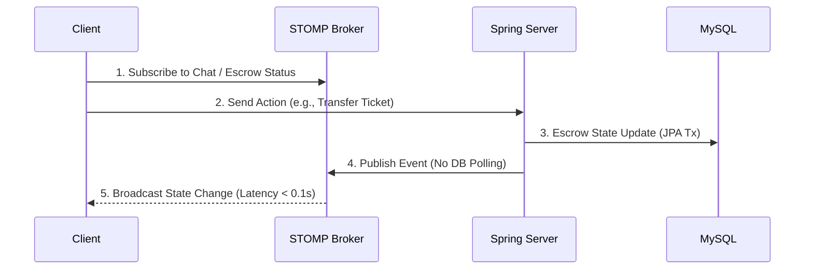
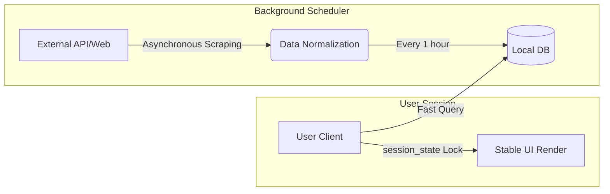
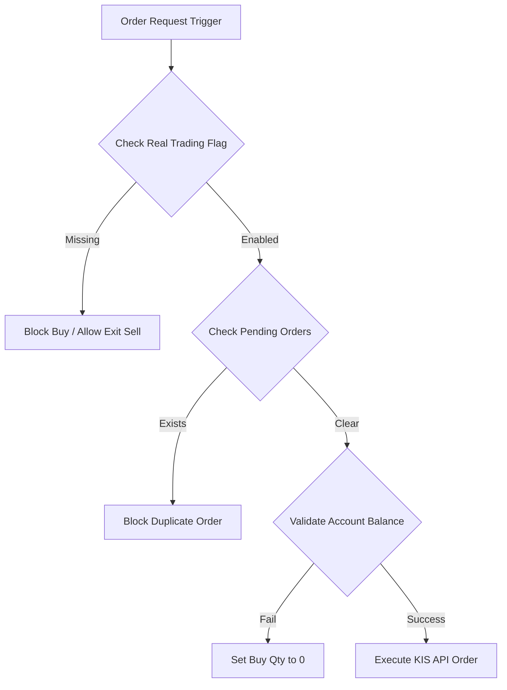
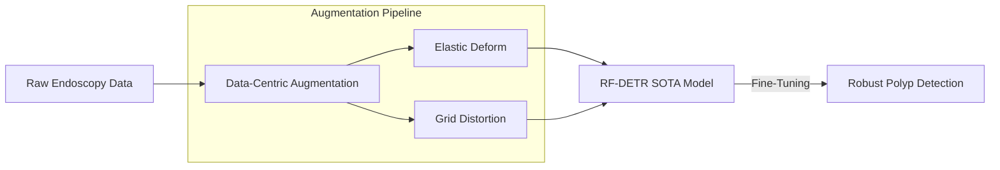
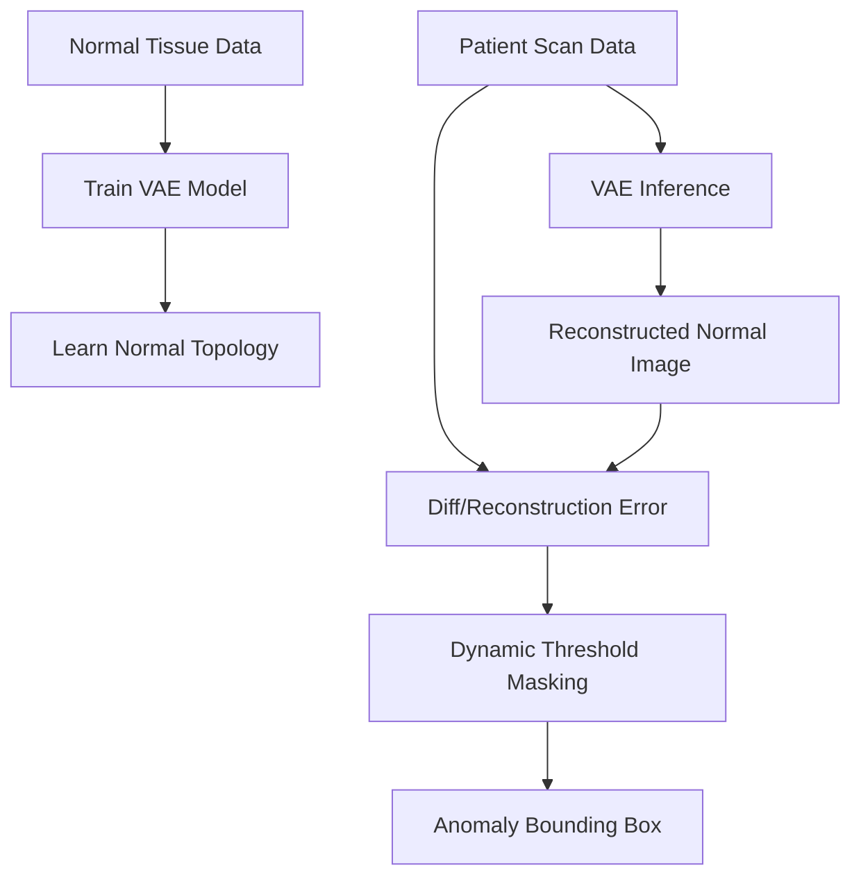

# 안진경 (Jin Kyoung Ahn)
**Data-Driven Full-Stack Engineer**
📧 Email: anjin0910@gmail.com | 🐙 GitHub: [github.com/anjin0910-afk](https://github.com/anjin0910-afk)

---

## 📌 Summary

**"프론트엔드부터 백엔드, 데이터 파이프라인까지 경계 없이 문제를 해결합니다."**
**Full-Stack Software Engineer**

복잡한 데이터 처리부터 대규모 웹 트래픽 제어까지. 도메인과 기술 스택의 한계를 두지 않고, 비즈니스 목적에 부합하는 가장 최적화된 프로덕션 서비스를 설계합니다.

의공학을 전공하며 딥러닝과 데이터를 탐구했던 경험은 저에게 '복잡한 문제를 체계적으로 쪼개고 분석하는 공학적 사고력'을 길러주었습니다. 이를 바탕으로 현재는 특정 기술에 얽매이기보다 웹 생태계 전반을 다루며, 사용자와 맞닿은 프론트엔드부터 이를 뒷받침하는 단단한 백엔드 서버를 구축하는 풀스택 엔지니어로 활약하고 있습니다.

저는 단순히 코드가 '작동하는 것'에 만족하지 않습니다. 에러 이면의 진짜 원인을 파악하기 위해 네트워크 흐름과 백엔드 구조를 집요하게 추적합니다. 대규모 트래픽이나 복잡한 비즈니스 로직(에스크로, 실시간 통신 등) 앞에서도 멈추지 않는, 신뢰할 수 있는 서비스를 구축하는 데 주력하고 있습니다.

---

## 🛠 Skills
- **Languages:** Python, TypeScript, JavaScript, SQL, HTML/CSS
- **Backend / Infra:** Spring Boot, JPA, Node.js, WebSockets (STOMP), MySQL, REST APIs
- **Frontend:** React, Tailwind CSS, Streamlit
- **AI & Data Pipeline:** PyTorch, TensorFlow, OpenCV, BeautifulSoup4, pykrx, Seaborn
- **Tools:** Git, GitHub

---

## 🚀 Projects

### 1. [티켓 에스크로 도메인] 실시간 고빈도 트랜잭션 DB I/O 80% 절감 및 동시성 제어
- **문제 해결 기술 스택:** Spring Boot, WebSockets (STOMP), JPA, MySQL
- **문제 상황 (Problem):** 에스크로 상태 전이와 다자간 실시간 채팅이 동시다발적으로 발생하는 환경에서, 단순 API Polling 방식은 막대한 DB 병목과 서버 오버헤드를 유발했습니다.
- **해결 과정 (Action):** 
  - TCP 연결 기반의 양방향 통신망과 Publish-Subscribe 패턴의 메시지 브로커(STOMP) 계층을 도입했습니다.
  - 30초 지연 분산 오프로딩(Off-loading)을 설계하여 트랜잭션과 실시간 상태 전이를 효과적으로 분리했습니다.
  - Spring Boot와 JPA를 활용해 트랜잭션의 철저한 상태 일관성과 롤백 통제를 보장했습니다.
- **해결 결과 (Result):** 불필요한 서버 폴링을 제거하여 DB I/O 부하를 80% 이상 혁신적으로 절감하였고, 타 클라이언트의 상태 전이를 0.1초 지연 없이 브로드캐스팅해 냈습니다.

### 2. [금융 시그널 도메인] 트래픽 스파이크 시 API 타임아웃 0% 달성을 위한 비동기 파이프라인 구축
- **문제 해결 기술 스택:** Python, BeautifulSoup4, Streamlit (session_state)
- **문제 상황 (Problem):** 다중 접속 시 외부 금융 데이터 API에 동기식 라이브 스크래핑을 요청하면서, 타겟 서버의 의심 요청 차단(IP Block)과 심각한 동기식 렌더 지연(API 타임아웃)이 발생했습니다. 또한, Streamlit의 잦은 핫 로딩으로 사용자가 입력 중이던 금융 설문 데이터가 증발하는 UX 결함이 존재했습니다.
- **해결 과정 (Action):**
  - **비동기 캐싱 구조 도입:** 외부 스크래핑을 유저의 요청(동기)과 분리하여, 서버 내부에서만 1시간 단위 자율 스케줄러로 비동기 수집(DAQ)을 수행하고 로컬 DB로 적재하도록 아키텍처를 뒤집었습니다.
  - **영구 세션 잠금(Cache-lock):** Streamlit의 `session_state`를 활용한 캐시-락 테크닉을 개발하여 화면이 재랜더링 되더라도 사용자의 복합적인 데이터 입력 상태를 영속적으로 보존했습니다.
- **해결 결과 (Result):** 트래픽 집중 시 렌더 대기 시간을 극적으로 단축하였고, DB 타임아웃 오류 발생 확률을 0%에 가깝게 완벽히 방어했습니다.

### 3. [알고리즘 트레이딩 도메인] Fail-safe 기반 중복 주문 차단 및 매매 안전장치 고도화
- **문제 해결 기술 스택:** Python, KIS Open API, PyTest, 객체 지향 상태 관리
- **문제 상황 (Problem):** 자동매매 시스템에서 계좌 상태 파악에 실패하거나 이전 주문이 미체결된 불확실한 상태에서 신규 매수가 발생할 경우, 자본의 막대한 손실로 이어질 수 있는 치명적인 취약점이 존재했습니다.
- **해결 과정 (Action):**
  - **주문 추적 Guard 배치:** 단일 주문 한도와 일일 손실 한도, 그리고 동일 종목 미체결 주문 여부를 Broker API 호출 직전에 다시 확인하는 방어선을 구축했습니다.
  - **Fail-safe 우선 설계:** 계좌 평가금액 조회 실패 시 신규 매수 수량을 즉시 0으로 처리하고, `ENABLE_REAL_TRADING` 플래그 누락 시 매수를 원천 차단하되, 리스크 관리를 위한 '청산 목적 매도'는 별도 플래그로 분리해 운영 정책을 정교화했습니다.
- **해결 결과 (Result):** 수익률 최적화 이전에 '잘못된 주문 발생 0건'을 보장하는 고도의 안전성을 확보했으며, 실제 API 비호출 검증 및 monkeypatch 테스트로 안정성을 입증했습니다.

### 4. [의료 엣지 비전 도메인] 조명 왜곡 환경 극복 및 mAP 7% 향상 실시간 객체 탐지 시스템
- **문제 해결 기술 스택:** PyTorch, RF-DETR, Data-Centric AI (Elastic Deform)
- **문제 상황 (Problem):** 내시경 점막 표면의 동적 빛 반사와 왜곡된 물리적 현상으로 인해 자체 구축한 퓨전 모델(CenterNet+RetinaNet)이 정확도 한계와 오버피팅에 직면했습니다.
- **해결 과정 (Action):**
  - **아키텍처 피봇팅:** 독자적 아키텍처에 대한 고집을 버리고 실패 원인을 디버깅한 후, SOTA 어텐션 기반 모델인 RF-DETR 파인튜닝으로 전격 전환했습니다.
  - **데이터 중심(Data-Centric) 증강:** 단순 회전/반전이 아닌 내장벽의 질감을 모사하는 `Elastic Deform`과 `Grid Distortion` 기하학적 왜곡 증강 모듈을 도입해, 모델이 빛 반사가 아닌 형태학적 피처에 집중하도록 유도했습니다.
- **해결 결과 (Result):** 기존 베이스라인 대비 +7% mAP 정밀도 상승을 이뤄냈으며, 가중치 제약 통제를 통해 상용 엣지(GPU) 환경에서 22+ FPS의 병목 없는 쓰루풋을 입증했습니다. (전국 공학경진대회 대상 수상)

### 5. [비지도 의료 검출 도메인] 라벨링 없이 병변을 탐지하는 재구성 오차 기반 검출 파이프라인
- **문제 해결 기술 스택:** TensorFlow, VAE (Variational AutoEncoder), 차영상 오차 함수
- **문제 상황 (Problem):** 악성 종양에 대해 철저히 라벨링(Label)된 정답 데이터를 수급하는 것은 천문학적 비용과 데이터 편향을 발생시킵니다.
- **해결 과정 (Action):**
  - **비지도 학습(Unsupervised) 인프라 구축:** 구하기 쉬운 '건강한 정상 조직 이미지'만으로 정상 토폴로지를 인코딩 및 시각화하는 VAE 베이스라인을 설계했습니다.
  - **수학적 차영상 및 동적 임계값 개발:** 실제 환자 데이터와 모델의 '정상 예측 데이터' 간의 재구성 오차(Reconstruction Error)를 연산하고, 1차원적 하드코딩 마스킹 대신 이미지 픽셀 분포 비율을 실시간 계산하는 '동적 노이즈 클리닝' 로직을 단독 개발했습니다.
- **해결 결과 (Result):** 값비싼 라벨링 데이터 없이도 알고리즘 분할 정밀도를 상시 90% (Dice Coefficient) 수준으로 안정화하고 노이즈 오탐지율을 대폭 하향 조정했습니다.

---

## 🏆 Experience / Education / Awards
- **학력 (Education)**
  - 건양대학교 의공학과 (Biomedical Engineering) 학사
- **주요 수상 내역 (Awards & Honors)**
  - **공학혁신상 (산업통상자원부 장관 주관, 2023):** 창의혁신 DNA 산학협력 프로젝트 비지도 검출 공학적 우수성 인정 단독 수상 (VAE 비지도 학습 프로젝트)
  - **대상 / 금상 (2023):** 제17회 건양대학교 캡스톤디자인 경진대회 (RF-DETR 실시간 엣지 비전 프로젝트)
  - **동상 (2023):** 전국 공학교육혁신 컨소시엄 창의적 종합설계 경진대회
