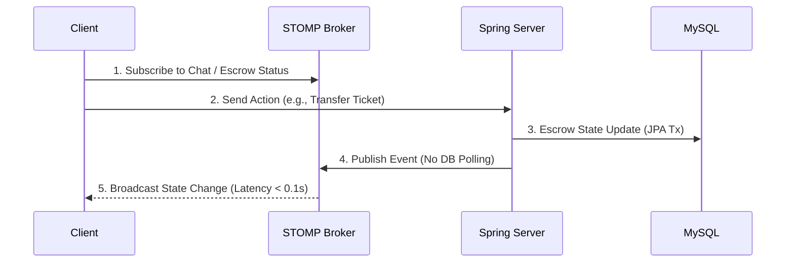
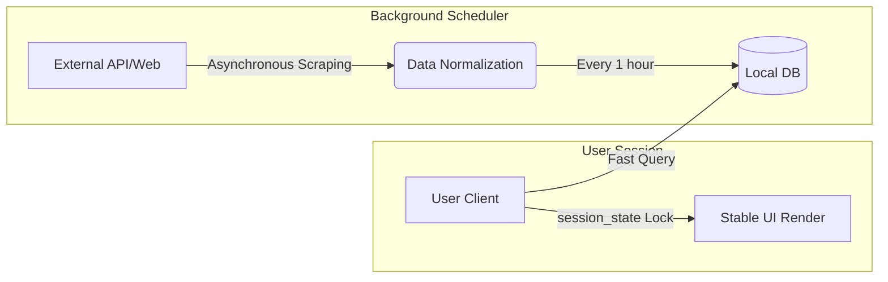
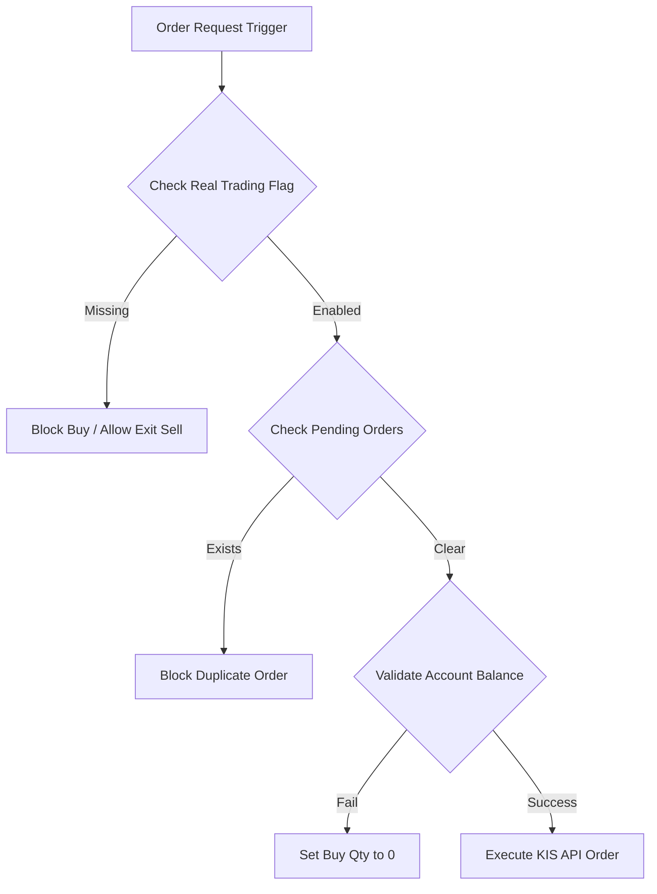
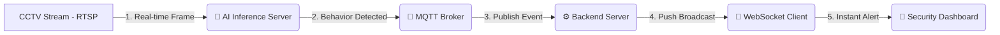
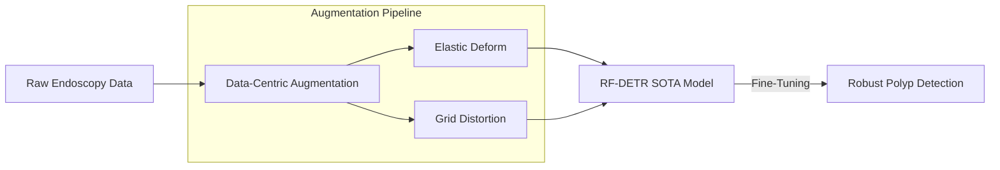
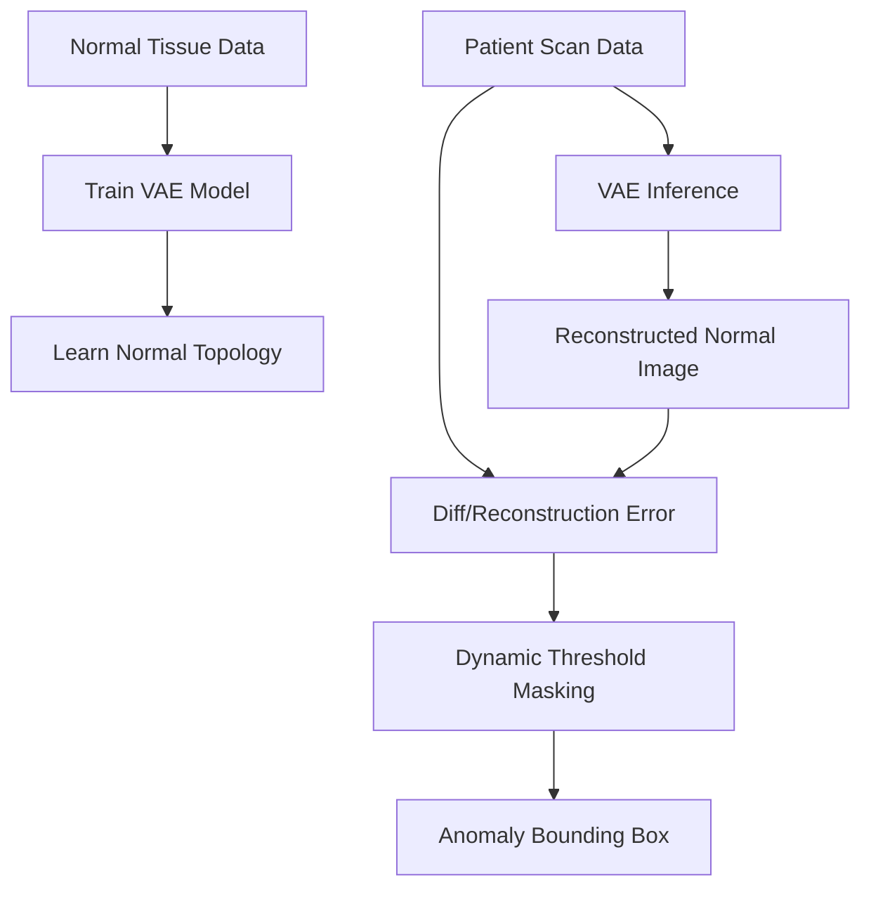

# 안진경 (An Jin Gyeong)
**AI Engineer | Computer Vision & Real-time AI Pipeline**
📧 Email: anjin0910@gmail.com | 🐙 GitHub: [github.com/Anjingyeong](https://github.com/Anjingyeong)

---

## 📌 Summary

**의공학 기반의 의료 AI 프로젝트 경험을 바탕으로, 현재는 AI 모델의 추론 결과를 실제 서비스와 연결하는 엔지니어링에 집중하고 있습니다.**

- **실시간 비전 AI 파이프라인 구현:** RF-DETR 기반 대장 내시경 용종 검출 시스템에서 **mAP@50 86.2%** 및 **22+ FPS**의 실시간 추론 성능을 안정적으로 확보했습니다.
- **Data-Centric AI 기반 도메인 문제 해결:** VAE 기반 비지도 병변 검출 프로젝트에서 **Anomaly Detection** 및 **Dynamic Threshold 후처리**를 적용하여 정밀 의료영상 라벨 부족과 밝기 편차 한계를 주도적으로 극복했습니다.
- **운영 환경과 연결되는 실서비스 엔지니어링:** 스마트 안전 관제 프로젝트에서 **RTSP → AI 추론 → MQTT → WebSocket → 관제 대시보드**로 이어지는 이벤트 전달 파이프라인 계층을 구축하고, frameId와 timestamp 기반의 Evidence Chain을 통해 AI 결과가 신뢰할 수 있는 증거 메타데이터와 함께 최종 화면까지 도달하는 전체 실시간 흐름을 설계했습니다.

---

## 🛠 Skills
- **Languages:** Python, TypeScript, JavaScript, SQL, HTML/CSS
- **Backend / Infra:** Spring Boot, JPA, Node.js, WebSockets (STOMP), MySQL, REST APIs
- **Frontend:** React, Tailwind CSS, Streamlit
- **AI & Data Pipeline:** PyTorch, TensorFlow, OpenCV, BeautifulSoup4, pykrx, Seaborn
- **Tools:** Git, GitHub

---

## 🚀 Projects

### 1. [티켓 에스크로 도메인] 실시간 고빈도 트랜잭션 DB I/O 80% 절감 및 동시성 제어
- **문제 해결 기술 스택:** Spring Boot, WebSockets (STOMP), JPA, MySQL
- **문제 상황 (Problem):** 에스크로 상태 전이와 다자간 실시간 채팅이 동시다발적으로 발생하는 환경에서, 단순 API Polling 방식은 막대한 DB 병목과 서버 오버헤드를 유발했습니다.
- **해결 과정 (Action):** 
  - TCP 연결 기반의 양방향 통신망과 Publish-Subscribe 패턴의 메시지 브로커(STOMP) 계층을 도입했습니다.
  - 30초 지연 분산 오프로딩(Off-loading)을 설계하여 트랜잭션과 실시간 상태 전이를 효과적으로 분리했습니다.
  - Spring Boot와 JPA를 활용해 트랜잭션의 철저한 상태 일관성과 롤백 통제를 보장했습니다.
- **해결 결과 (Result):** 불필요한 서버 폴링을 제거하여 DB I/O 부하를 80% 이상 혁신적으로 절감하였고, 타 클라이언트의 상태 전이를 0.1초 지연 없이 브로드캐스팅해 냈습니다.

### 2. [금융 시그널 도메인] 트래픽 스파이크 시 API 타임아웃 0% 달성을 위한 비동기 파이프라인 구축
- **문제 해결 기술 스택:** Python, BeautifulSoup4, Streamlit (session_state)
- **문제 상황 (Problem):** 다중 접속 시 외부 금융 데이터 API에 동기식 라이브 스크래핑을 요청하면서, 타겟 서버의 의심 요청 차단(IP Block)과 심각한 동기식 렌더 지연(API 타임아웃)이 발생했습니다. 또한, Streamlit의 잦은 핫 로딩으로 사용자가 입력 중이던 금융 설문 데이터가 증발하는 UX 결함이 존재했습니다.
- **해결 과정 (Action):**
  - **비동기 캐싱 구조 도입:** 외부 스크래핑을 유저의 요청(동기)과 분리하여, 서버 내부에서만 1시간 단위 자율 스케줄러로 비동기 수집(DAQ)을 수행하고 로컬 DB로 적재하도록 아키텍처를 뒤집었습니다.
  - **영구 세션 잠금(Cache-lock):** Streamlit의 `session_state`를 활용한 캐시-락 테크닉을 개발하여 화면이 재랜더링 되더라도 사용자의 복합적인 데이터 입력 상태를 영속적으로 보존했습니다.
- **해결 결과 (Result):** 트래픽 집중 시 렌더 대기 시간을 극적으로 단축하였고, DB 타임아웃 오류 발생 확률을 0%에 가깝게 완벽히 방어했습니다.

### 3. [알고리즘 트레이딩 도메인] Fail-safe 기반 중복 주문 차단 및 매매 안전장치 고도화
- **문제 해결 기술 스택:** Python, KIS Open API, PyTest, 객체 지향 상태 관리
- **문제 상황 (Problem):** 자동매매 시스템에서 계좌 상태 파악에 실패하거나 이전 주문이 미체결된 불확실한 상태에서 신규 매수가 발생할 경우, 자본의 막대한 손실로 이어질 수 있는 치명적인 취약점이 존재했습니다.
- **해결 과정 (Action):**
  - **주문 추적 Guard 배치:** 단일 주문 한도와 일일 손실 한도, 그리고 동일 종목 미체결 주문 여부를 Broker API 호출 직전에 다시 확인하는 방어선을 구축했습니다.
  - **Fail-safe 우선 설계:** 계좌 평가금액 조회 실패 시 신규 매수 수량을 즉시 0으로 처리하고, `ENABLE_REAL_TRADING` 플래그 누락 시 매수를 원천 차단하되, 리스크 관리를 위한 '청산 목적 매도'는 별도 플래그로 분리해 운영 정책을 정교화했습니다.
- **해결 결과 (Result):** 수익률 최적화 이전에 '잘못된 주문 발생 0건'을 보장하는 고도의 안전성을 확보했으며, 실제 API 비호출 검증 및 monkeypatch 테스트로 안정성을 입증했습니다.

### 4. [지능형 관제 도메인] AI 기반 스마트 안전 관제 시스템 (SK쉴더스 5기)
- **문제 해결 기술 스택:** Python, FastAPI, Docker, MQTT, WebSockets, RTSP
- **문제 상황 (Problem):** CCTV 실시간 영상 스트림(RTSP)에서 AI가 이상행동(낙상, 실신)을 감지하고, MQTT와 WebSocket으로 실시간 경보를 대시보드에 전송하는 실시간 관제 시스템 구축 과정에서, 다중 컨테이너 환경의 배포 구성과 초기 설정 등 반복적인 작업으로 인해 핵심 성능 최적화에 집중하기 어려운 병목이 있었습니다.
- **해결 과정 (Action):**
  - **AI 기반 고효율 워크플로우 도입:** Hermes Agent와 Codex를 활용하여 작업 목표와 검증 기준을 명확히 정의하는 AI 개발 협업 구조 구축.
  - **프롬프트 고도화 및 검증 루프:** 구현 사양, Edge-case 제약 조건, 단위 테스트 명령을 포함한 구조화된 프롬프트를 바탕으로 AI를 활용해 가상화 및 보일러플레이트를 자동화.
  - **실시간 스트림 파이프라인 통합:** RTSP 프레임 지연 최소화, MQTT 이벤트 중복 감지 제어, WebSocket 세션 관리 등 핵심 서비스 가용성 확보에 리소스를 집중.
- **해결 결과 (Result):** 반복 셋업 시간을 극적으로 감소시키고, RTSP → AI 추론 → MQTT → WebSocket으로 이어지는 지연 최소화 관제 이벤트 스트림 파이프라인을 안정적으로 설계·구현하고 있습니다.

### 5. [의료 엣지 비전 도메인] RF-DETR 기반 실시간 대장 내 용종 검출 시스템
- **문제 해결 기술 스택:** Python, PyTorch, RF-DETR, DINOv2, OpenCV
- **문제 상황 (Problem):** 대장 내시경 영상 특유의 동적 빛 반사, 장벽의 물리적 왜곡 및 용종 형태의 다양성으로 인해 기존의 단순 퓨전 모델(CenterNet+RetinaNet)은 정확도 정체 및 오버피팅이 발생했습니다. 실제 임상 환경 도입을 위해 고성능 서버 없이 저사양 Edge 디바이스 환경에서도 병목 없이 실시간 작동이 가능하도록 정확도와 추론 속도를 모두 충족해야 했습니다.
- **해결 과정 (Action):**
  - **Data-Centric & Light-weight 모델링:** 모델의 체급을 무작정 키우기보다, 의료 영상의 비정형 왜곡은 데이터 단계에서 해결하고 하드웨어 리소스 한계는 모델 경량화로 돌파하는 방향으로 선전.
  - **기하학적 왜곡 증강:** 대장 내장벽의 불규칙한 질감과 왜곡 현상을 모사하기 위해 `Grid Distortion` 및 `Elastic Deform` 증강 파이프라인을 구축하여 형태학적 피처 학습 유도.
  - **구조적 가지치기 및 OpenCV 연동:** 엣지 환경의 메모리 제약을 극복하고자 `Structural Pruning` 기법을 활용해 가중치 제약 통제를 적용하고, OpenCV 기반 전처리 및 실시간 추론 시각화 구성.
- **해결 결과 (Result):** 최고 성능 mAP@50 86.2% (베이스라인 대비 약 7%p 상승) 및 상용 엣지(GPU) 환경에서 22+ FPS 이상의 실시간 추론 성능을 안정적으로 확보하였습니다. (🏆 제17회 건양대학교 캡스톤디자인 경진대회 금상/대상 및 전국 공학교육혁신 컨소시엄 경진대회 동상 수상)

### 6. [비지도 의료 검출 도메인] VAE 기반 비지도 학습 유방암 병변 검출 시스템
- **문제 해결 기술 스택:** Python, TensorFlow, VAE (Variational AutoEncoder), 차영상 오차 함수
- **문제 상황 (Problem):** 유방 초음파 영상은 정밀한 병변 주석(Labeling) 작업에 막대한 전문의 리소스와 비용이 발생하여, 신뢰도 높은 지도학습 데이터셋을 대량 확보하기 어려운 한계가 존재했습니다. 기존 라이브러리에 의존하는 블랙박스 구조의 모델은 암세포와 정상 조직 간의 미세한 픽셀 분포 차이를 섬세하게 포착하기 어려웠습니다.
- **해결 과정 (Action):**
  - **비지도 이상 탐지(Anomaly Detection):** 병변 라벨을 대량 확보하는 방식 대신, 정상 조직 데이터만 학습한 뒤 정상 패턴에서 벗어나는 영역을 탐지하는 방식으로 문제 재정의.
  - **커스텀 Loss Function 설계:** TensorFlow 저수준 API를 활용해 정상 분포 분산 오차(KLD)와 이미지 재구성 오차(MSE)의 텐서 가중치를 조작하는 커스텀 손실 함수를 설계하여 암세포의 미세한 이질성을 돋보이게 학습시킴.
  - **동적 임계값 필터 개발:** 입력 이미지와 재구성 이미지 간의 차영상 Reconstruction Error Map을 생성하고, 영상별 밝기/노이즈 편차 보정을 위해 픽셀 분포 비율을 실시간 계산하는 `Dynamic Threshold` 후처리 로직 적용.
- **해결 결과 (Result):** 값비싼 라벨 데이터 없이도 알고리즘 분할 정밀도를 Dice Coefficient 기준 상시 90% 수준으로 안정화하였으며, 초음파 노이즈 환경 하에서의 모델 강건성을 입증하여 산업통상자원부 장관 주관 🏆 공학혁신상을 수상하였습니다.

---

## 🏆 Experience / Education / Awards
- **학력 (Education)**
  - 건양대학교 의공학과 (Biomedical Engineering) 학사
- **주요 수상 내역 (Awards & Honors)**
  - **공학혁신상 (산업통상자원부 장관 주관, 2023):** 창의혁신 DNA 산학협력 프로젝트 비지도 검출 공학적 우수성 인정 단독 수상 (VAE 비지도 학습 프로젝트)
  - **대상 / 금상 (2023):** 제17회 건양대학교 캡스톤디자인 경진대회 (RF-DETR 실시간 엣지 비전 프로젝트)
  - **동상 (2023):** 전국 공학교육혁신 컨소시엄 창의적 종합설계 경진대회
