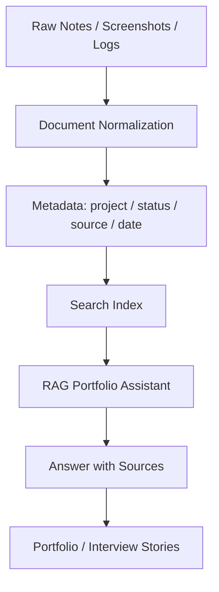

# LLM Wiki / Evidence Wiki / RAG Case Study

## 한 줄 소개

프로젝트 실험, 오류 해결, 의사결정 기록을 흩어진 메모가 아니라 검색 가능하고 재사용 가능한 Evidence Wiki로 구조화한 RAG 기반 프로젝트 지식 시스템입니다.

## 문제정의

AI 프로젝트는 코드만으로 설명되지 않습니다. 왜 특정 모델을 선택했는지, 어떤 오류가 있었는지, 어떤 실험이 실패했는지, 어떤 기준으로 다음 개선을 정했는지가 시간이 지나면 쉽게 흩어집니다.

이 문제를 단순 문서 정리 문제가 아니라, **개발 과정에서 생성되는 지식을 검색 가능하고 면접/포트폴리오 근거로 재사용 가능한 자산으로 만드는 문제**로 재정의했습니다.

## RAG 도입 이유

일반 README는 최종 결과를 설명하는 데 강하지만, 실험 기록과 오류 해결의 탐색에는 약합니다. RAG 구조를 사용하면 문서, 검증 결과, UI 스크린샷, walkthrough를 evidence 단위로 검색하고 답변 근거로 묶을 수 있습니다.

## Hybrid Search 방향

현재 포트폴리오에는 구현 완료처럼 단정하지 않고, 고도화 방향으로 표현합니다.

- BM25: 정확한 키워드, 파일명, 오류 메시지 검색.
- Vector Search: 의미가 비슷한 실험/의사결정 기록 검색.
- Metadata Filtering: project, status, source type, date, evidence level 기준 필터링.
- RRF: keyword와 vector 결과를 합치는 후보 전략.
- Optional Re-ranking: 문서가 많아졌을 때 정확도 고도화 후보.
- 문서 관계 분석 고도화: 문서 관계가 커진 뒤의 확장 후보로만 정리.

## Evidence Wiki 구조

## 확인된 로컬 자료

| 자료 | 확인 내용 |
|---|---|
| `implementation_plan.md` | Modern AI Dashboard UI redesign 계획, CSS/RAG/Sidebar/Search/RagPanel 수정 계획 |
| `walkthrough.md` | 수정 파일 목록, Before/After, 디자인 시스템, `npm run lint`, `npm test`, `npm run build`, `git push` PASS 기록 |
| `task.md` | 작업 체크리스트 완료 상태 |
| `rag_answer_details_*.png`, `rag_debug_expanded_*.png` | RAG answer/detail UI 스크린샷 |
| `overview_page_screenshot_*.png`, `search_card_preview_screenshot_*.png` | 검색/문서 UI 스크린샷 |
| `py_compile_verification_results_*.png`, `verification_result_summary_*.png` | 검증 결과 이미지 |

## 포트폴리오 활용 가치

이 프로젝트는 "RAG 챗봇을 만들었다"보다 다음 메시지에 강점이 있습니다.

- AI 프로젝트에서 코드보다 중요한 의사결정 근거와 실패 기록을 관리했습니다.
- 포트폴리오 문구를 막연한 자기소개가 아니라 evidence 기반 story로 재작성할 수 있게 했습니다.
- 실험 결과, 오류 해결, 검증 로그를 면접 답변의 근거로 다시 참조할 수 있게 했습니다.
- 개발자가 AI 도구를 쓸 때도 목표, 제약, 검증 기준을 명시해야 품질이 유지된다는 점을 보여줍니다.

## STAR-RN

### S: Situation

프로젝트가 복잡해지면서 실험 결과, 오류 해결, 의사결정 기록이 여러 도구와 폴더에 흩어졌습니다. 시간이 지나면 "무엇을 했는지"보다 "왜 그렇게 했는지"를 설명하기 어려워지는 문제가 있었습니다.

### T: Task

개발 과정에서 생성된 지식을 검색 가능하고 재사용 가능한 형태로 정리하는 내부 지식 시스템을 구축하는 것이 목표였습니다. 포트폴리오와 면접 답변에서도 근거로 사용할 수 있어야 했습니다.

### A: Action

문서 기반 Wiki를 구성하고, RAG 검색 구조와 Hybrid Search 방향을 정리했습니다. 실험 결과, 트러블슈팅, UI 검증, 빌드/테스트 기록을 evidence로 축적하고, 포트폴리오 문서와 연결 가능한 구조를 설계했습니다.

### R: Result

프로젝트 기록을 단순 메모가 아니라 지식 자산으로 전환했습니다. 오류 해결과 실험 근거를 빠르게 재참조할 수 있는 기반을 만들었고, 포트폴리오 정리와 면접 답변 근거로 활용할 수 있게 했습니다.

### R: Reflection

AI 프로젝트에서는 코드뿐 아니라 의사결정 근거와 실패 기록이 중요합니다. RAG는 단순 챗봇이 아니라 개발 지식 관리 도구로 활용될 수 있습니다.

### N: Next

- metadata filtering + BM25 + vector search + RRF 구조 고도화.
- optional re-ranking 추가 검토.
- 문서 관계 분석 고도화는 문서 관계와 규모가 커졌을 때 확장 후보로 분리.
- observability와 평가셋 기반 답변 품질 검증 추가.

## 구현 상태 구분

| 상태 | 내용 |
|---|---|
| 확인됨 | 로컬 brain 문서, walkthrough, RAG UI 스크린샷, 검증 결과 이미지 |
| 실험/구성됨 | Modern AI Dashboard UI, RAG answer/source/debug UI 패턴 |
| 고도화 예정 | metadata filtering, BM25+vector+RRF, re-ranking, 문서 관계 분석 |
| 검증 필요 | 실제 검색 인덱스 코드 전체, 배포 환경, LLM API key 설정 |
