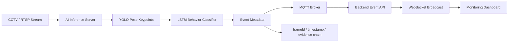

# Smart Safety AI Case Study

## 한 줄 소개

RTSP 기반 CCTV 영상에서 이상행동을 감지하고, MQTT/WebSocket 이벤트로 관제 화면에 전달하는 실시간 AI 관제 보조 시스템입니다.

## 구현 상태 구분

| 구분 | 내용 |
|---|---|
| 구현됨으로 작성 가능 | RTSP 기반 실시간 영상 입력 흐름, MQTT/WebSocket 기반 이벤트 전달 구조, Docker/FastAPI 중심 AI 추론 서버 방향, 포트폴리오 내 관제 파이프라인 설명 |
| 실험 중 또는 검증 필요 | YOLO Pose keypoint 추출, LSTM 시계열 행동 분류, Recall/Precision/F1, FP/FN 수치, overlay 동기화 세부 구현 |
| 향후 계획으로만 작성 | hard negative 재학습, Langfuse 또는 별도 observability, 운영 환경별 threshold 정책, 고도화 AI 기능 확장 |
| Git 검증 필요 | AI repo, backend repo, frontend repo, infra repo, `run_registered_cameras.py`, MQTT payload schema, frame sync 코드, LSTM 학습/추론 코드 |

## 문제정의

CCTV는 많지만 관제자가 모든 화면을 24시간 동일한 집중도로 확인하기 어렵습니다. 단순히 "낙상을 탐지하는 모델"을 만드는 것만으로는 실제 관제 문제를 해결할 수 없습니다. 관제 시스템에서는 영상 프레임, 이벤트 발생 시점, 알림 UI, 담당자의 확인 흐름이 함께 맞아야 합니다.

따라서 이 프로젝트의 문제는 "YOLO/LSTM 모델을 구현했다"가 아니라, **실시간 영상 AI가 관제자의 판단 공백을 줄이도록 이벤트 증거와 알림 흐름을 안정적으로 연결하는 문제**로 재정의합니다.

## 접근 방식

### 왜 실시간 스트림 구조인가

녹화 영상을 사후 분석하는 방식은 사고 대응 시간을 줄이기 어렵습니다. 관제 보조 시스템에서는 실시간성이 중요하므로 RTSP 영상 입력, AI 추론, 이벤트 발행, 대시보드 알림을 하나의 흐름으로 설계해야 합니다.

### 왜 MQTT/WebSocket 분리인가

영상 스트림과 이벤트 메타데이터를 같은 경로로 처리하면 overlay 동기화, 재전송, 알림 상태 관리가 복잡해집니다. WebRTC 또는 영상 스트림은 화면 표시를 담당하고, MQTT/WebSocket은 event metadata와 알림 전파를 담당하도록 분리하는 방향이 운영 안정성에 유리합니다.

### 왜 evidence chain이 필요한가

관제 이벤트는 "감지됨"만으로 충분하지 않습니다. frameId, timestamp, cameraId, eventType, confidence, source model version 같은 evidence가 함께 남아야 오탐/미탐 분석과 사후 검증이 가능합니다.

## 아키텍처

## 내 역할

- AI 추론 결과가 서비스 이벤트로 전달되는 파이프라인을 정리했습니다.
- RTSP, MQTT, WebSocket, Docker/FastAPI 기반 구성 요소의 역할을 나눠 문서화했습니다.
- Codex/Hermes/Antigravity를 활용해 반복 설정과 문서화 작업을 효율화하되, 구현 완료 여부와 향후 계획을 분리했습니다.
- 오탐/미탐 분석, hard negative 후보, threshold/tracker/frame drop/active_tracks 같은 운영 안정성 관점을 포트폴리오 서술의 핵심으로 끌어올렸습니다.

## 핵심 구현 또는 검증 대상

| 영역 | 수행 내용 | 포트폴리오 표현 |
|---|---|---|
| 영상 입력 | RTSP 기반 CCTV 스트림 수신 흐름 | 구현됨 또는 연동 검증 중 |
| AI 추론 | YOLO Pose 기반 keypoint 추출, LSTM 행동 분류 | Git 검증 전에는 실험/설계로 표현 |
| 이벤트 전송 | MQTT event metadata 발행 | 구현/연동 검증 필요 |
| 화면 알림 | WebSocket 기반 대시보드 알림 | 구현/연동 검증 필요 |
| 증거 관리 | frameId, timestamp, event id 연결 | 설계 또는 Next Step으로 분리 |
| 평가 | Recall, Precision, F1, FP/FN | 수치 확인 전까지 임의 작성 금지 |

## 실험 / 검증

현재 포트폴리오 저장소에는 스마트 안전 관제 시스템의 별도 Git 저장소가 포함되어 있지 않습니다. 따라서 수치나 코드 수준 구현 여부는 확정하지 않습니다.

문서에는 다음과 같이 구분합니다.

- **확인된 산출물:** 포트폴리오 문서와 웹 프로젝트 내 관제 시스템 설명.
- **검증 필요:** AI 추론 서버, backend/frontend/infra repo, `docker-compose`, MQTT schema, LSTM 코드.
- **성과 수치 미확인:** Recall, Precision, F1, FPS, latency는 확인 전까지 쓰지 않습니다.

## 기술적 난관

- 실시간 영상과 이벤트 메타데이터의 시간 동기화.
- frame drop이 발생했을 때 overlay와 evidence가 어긋나는 문제.
- 단순 confidence threshold로 오탐/미탐을 줄이기 어려운 문제.
- tracker, active_tracks, camera별 환경 차이로 인한 안정성 편차.
- 모델 정확도와 운영 신뢰성이 같은 의미가 아니라는 점.

## 성과

확인 가능한 정성 성과 중심으로 작성합니다.

- 실시간 영상 AI를 단순 모델 문제가 아니라 관제 이벤트 파이프라인 문제로 재정의했습니다.
- RTSP, AI 추론, MQTT, WebSocket, dashboard를 계층별로 분리해 설명할 수 있는 구조를 만들었습니다.
- 오탐/미탐 분석과 evidence chain을 향후 고도화의 핵심 기준으로 정리했습니다.
- 구현 완료, 실험 중, Next Step을 분리해 과장 없는 포트폴리오 서술 기준을 마련했습니다.

## STAR-RN

### S: Situation

CCTV 화면은 많고 관제자의 집중력은 제한되어 있습니다. 단순 탐지 모델이 아니라 실시간 관제 보조 시스템으로 동작해야 했기 때문에, AI 결과가 화면과 이벤트 기록으로 신뢰성 있게 이어져야 했습니다.

### T: Task

AI 파트에서 이상행동 탐지 모델과 실시간 추론 파이프라인을 설계/구현하고, 오탐/미탐을 분석해 실서비스 환경에서의 안정성을 검증하는 것이 목표였습니다.

### A: Action

YOLO Pose 기반 keypoint 추출, LSTM 기반 시계열 행동 분류, RTSP/WebRTC/MQTT 기반 실시간 파이프라인을 핵심 구조로 정리했습니다 (구현 일부 Git 검증 필요). 영상과 event metadata를 분리하고, frameId/timestamp/evidence chain, FP/FN 분석, hard negative 후보, threshold/tracker/frame drop/active_tracks 분석을 운영 안정성 기준으로 설계했습니다.

### R: Result

현재 확인된 범위에서는 정량 수치를 임의로 작성하지 않습니다. 대신 실시간 이벤트 발행 구조와 overlay 동기화 설계, 운영 안정성 중심의 개선 방향을 포트폴리오 문서로 정리했습니다.

### R: Reflection

AI 모델 성능만으로는 실제 서비스 품질을 보장할 수 없습니다. 영상 프레임과 이벤트 증거가 일치해야 신뢰 가능한 관제 시스템이 되며, 오탐/미탐 분석은 단순 평가가 아니라 재학습 전략의 출발점입니다.

### N: Next

- 승인된 real error 후보 기반 hard negative 재학습.
- frame_sync payload 고도화.
- Langfuse 또는 별도 observability 도입 검토.
- 운영 환경별 threshold 정책 검증.
- 고도화 AI 기능은 구현 완료가 아니라 향후 확장 후보로 분리.
