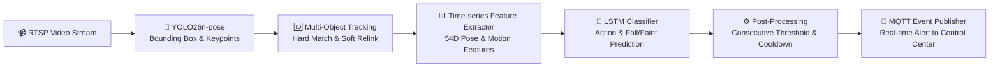

# Smart Safety AI Case Study

## 1. 문제 정의

CCTV 실시간 영상 분석에서 탐지 모델의 단독 성능만으로는 실제 안전 관제 요구사항을 만족하기 어렵습니다. 추론 속도가 아무리 빨라도 영상 수신, Bounding Box·Pose 추출, 시계열 행동 분석, Tracking ID 유지, 과거 프레임 적체 관리, 그리고 관제 알림 발행까지 연결되는 전체 파이프라인의 지연과 정합성을 제어해야 합니다.

이 프로젝트는 단순 모델 개발에 그치지 않고 **실시간 영상 AI의 정확도와 지연을 수치와 로그로 측정하며 안정적인 관제 이벤트 파이프라인을 완성하는 문제**로 정의했습니다.

## 2. 팀 구성과 본인 역할

- **팀 구성:** 총 5명의 팀 프로젝트에서 팀장을 맡아 AI·백엔드·프론트엔드·인프라 파트의 일정과 통합 기준을 관리했습니다.
- **본인 역할:** Pose 모델 비교, LSTM 행동 특징 설계, Tracking ID 재연결, 최신 프레임 처리 정책, TensorRT 추론 최적화와 MQTT 위험 이벤트 발행을 담당했습니다.

## 3. 전체 AI 파이프라인

RTSP 카메라 입력부터 관제 대시보드 이벤트 알림까지의 구조는 다음과 같습니다.

```mermaid
flowchart LR
    RTSP["📹 RTSP Video Stream"] --> Pose["👤 YOLO26n-pose\nBounding Box & Keypoints"]
    Pose --> Tracking["🆔 Multi-Object Tracking\nHard Match & Soft Relink"]
    Tracking --> Feature["📊 Time-series Feature Extractor\n54D Pose & Motion Features"]
    Feature --> LSTM["🧠 LSTM Classifier\nAction & Fall/Faint Prediction"]
    LSTM --> Post["⚙️ Post-Processing\nConsecutive Threshold & Cooldown"]
    Post --> MQTT["📡 MQTT Event Publisher\nReal-time Alert to Control Center"]
```

## 4. Pose 모델 선택

- **측정 현상:** YOLOv11n-pose는 Faint Recall 66.00%, F1-score 56.90%, 유효 시퀀스 131개를 기록했습니다. YOLO26n-pose는 Recall 86.44%, F1-score 64.97%, 유효 시퀀스 139개를 기록했습니다.
- **원인 분석:** Pose 모델 단독 FPS가 높더라도 관절 누락이나 시퀀스 생성 실패가 많으면 후속 LSTM 판단 성능이 저하됐습니다.
- **의사결정:** 단독 속도보다 실제 실신 미탐을 줄이는 Recall과 F1-score를 최우선 기준으로 선택했습니다.
- **결과:** Faint Recall과 시퀀스 생성 안정성이 높은 YOLO26n-pose를 최종 Pose 모델로 결정했습니다.

## 5. Tracking 단절

- **측정 현상:** 낙상 발생 시 동일 인물의 ID Switch가 8건 발생하고 Mean Track Coverage는 35.76%에 머물렀습니다.
- **원인 분석:** 입식 자세에서 누운 자세로 전환될 때 Bounding Box 종횡비와 중심점이 급변하며 기존 IoU 중심 매칭이 단절됐습니다.
- **의사결정:** IoU 중심 Hard Match 이후 frame gap·center ratio·velocity 기반 Soft Relink와 Grace Period를 순차 적용했습니다.
- **결과:** 자체 테스트 영상에서 ID Switch를 8건에서 1건으로 줄이고 Mean Track Coverage를 35.76%에서 49.70%로 향상시켰습니다.

## 6. 최신 프레임 우선 처리

- **측정 현상:** RTSP 입력 속도가 추론 속도를 초과하는 구간에서 과거 프레임이 큐에 적체되어 현재 시점 위험 알림 지연이 발생했습니다.
- **원인 분석:** Bounded Queue 및 최신 프레임 우선 폐기 정책이 없어 AI Worker가 모든 과거 프레임을 순차 처리하려 한 것이 원인이었습니다.
- **의사결정:** Reader-Inference 사이 Bounded Queue(maxsize=3)를 도입하고 Overwrite/Drop 정책을 적용했습니다.
- **결과:** 과거 프레임 누적 현상을 방지하고 실시간 현재성을 보장했습니다.

## 7. 54D 특징 확장

- **측정 현상:** 17개 관절 좌표/신뢰도 기반 51D 모델은 Accuracy 89.20%, F1-score 89.29%를 기록했습니다.
- **원인 분석:** 관절 현재 위치만으로는 서 있다가 하강하는 시간적 동적 전이를 직접 설명하기 부족했습니다.
- **의사결정:** center_drop(하강량), velocity(이동 속도), torso_angle(상체 기울기) 3개 특징을 추가하여 54D로 확장했습니다.
- **결과:** F1-score가 89.29%에서 93.49%로 향상되었고, False Positive 38.6% 감소, False Negative 38.9% 감소를 달성했습니다.

## 8. TensorRT

- **측정 현상:** PyTorch 추론 환경에서 YOLO 평균 지연은 9.454ms, 전체 처리 지연은 11.789ms로 측정됐습니다.
- **구현 및 결과:** TensorRT를 적용하여 YOLO 평균 지연을 9.454ms에서 4.723ms로 50.0% 감축했습니다. 최신 프레임 정책과 TensorRT가 함께 적용된 통합 환경에서 전체 처리 지연은 11.789ms에서 6.101ms로 48.2% 감소했습니다.

## 9. 협업과 통합

AI Worker에서 발행된 위험 이벤트는 MQTT QoS 1을 통해 Spring Boot 백엔드로 전달되고, WebSocket/STOMP를 거쳐 React 관제 대시보드에 브로드캐스트됩니다.
파트 간 eventId, originalEventId, timestamp, capturedAt 데이터 계약을 맞춰 End-to-End 알림 지연 평균 20.931ms(p95 26ms)를 달성했으며 29개 테스트 이벤트 모두 1초 이내에 전달됐습니다.

## 10. 검증 범위와 한계

- **추적 성능:** ID Switch 감소 및 Track Coverage는 자체 시나리오 내부 평가 결과이며, 공식 MOTA/HOTA 벤치마크 검증이 추가로 필요합니다.
- **통합 지연:** 전체 처리 지연 감소(11.789ms → 6.101ms)는 TensorRT 적용과 Bounded Queue 최신 프레임 처리 정책이 함께 적용된 결과입니다.
- **환경 일반화:** 평가 결과는 특정 카메라 각도 및 단일 GPU 환경 기준이므로 대규모 다중 카메라 시설 적용 시 조도·밀집도·네트워크 환경에 따른 수치 검증이 지속되어야 합니다.
